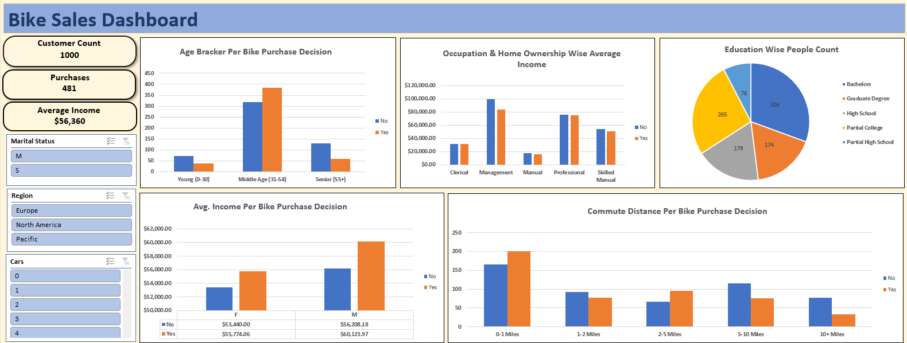

# 🚲 Bike Sales Data Analysis Dashboard (Excel Project)

This project analyzes bike purchase behavior using Excel and Pivot Tables to generate business insights and build an interactive dashboard.

---

## 📊 Dashboard Preview

---

## 🔍 Project Tasks

### 1️⃣ Data Cleaning
- Checked and removed duplicate records
- Prepared structured dataset for analysis

### 2️⃣ Pivot Table Insights
- Gender-wise Average Income per Bike Purchase
- Commute Distance vs Purchase Decision
- Age Bracket Analysis
- Occupation & Home Ownership vs Income
- Education-wise People Count

### 3️⃣ Dashboard Creation
- Built an interactive Excel dashboard
- Used Pivot Tables, Pivot Charts, and Slicers

---

## 🛠 Tools Used
- Microsoft Excel
- Pivot Tables
- Pivot Charts
- Data Cleaning Techniques
- Dashboard Design

---

## 📈 Key Insights
- Middle-aged group showed higher purchase rates
- Short commute distance had higher purchase probability
- Income and occupation influenced purchase decisions

---

🔗 Excel Project File Included in Repository

